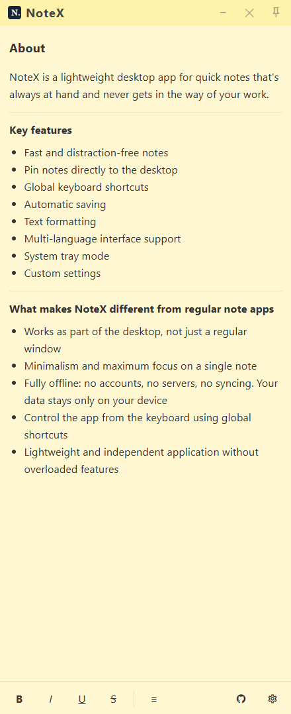
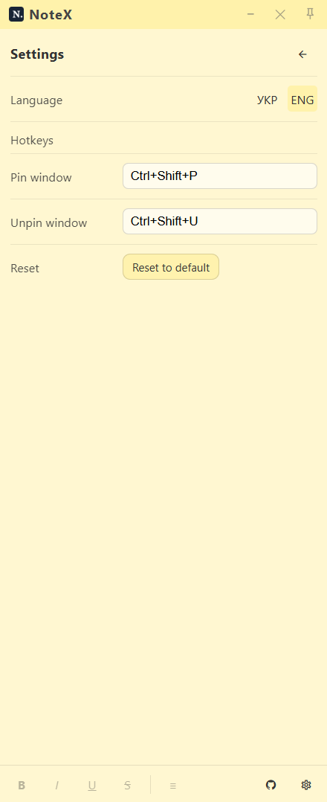

# NoteX

A lightweight desktop note app for Windows, Linux, and macOS, designed for capturing ideas, tasks, and thoughts as quickly as possible. The core idea of NoteX is an always-available note that can become part of your desktop.

## Screenshots




## Quick start

Get NoteX up and running in less than a minute.

```bash
git clone https://github.com/ohavrylyshyn/notex.git
cd notex
npm install
npm start
```

> **Requirements:** Node.js (LTS)
> For detailed installation instructions, see **[INSTALL.md](./INSTALL.md)**

## What makes NoteX different from regular note apps

- Works as part of the desktop, not just another window
- Minimalism with maximum focus on a single note
- Fully offline: no accounts, servers, or synchronization. Your data stays on your device
- Keyboard-driven control via global hotkeys
- Lightweight and independent app without unnecessary features

## Core features

### Quick notes

- Instant launch.
- Compact window with no visual clutter.
- Write thoughts as fast as they appear.

### Text formatting

- Bold, italic, underline, strikethrough.
- Bullet lists.
- Direct in-place editing (WYSIWYG).

### Auto-save

- Notes are saved automatically while typing.
- No data loss when closing the app.
- Local storage using an SQLite database.

### Desktop pinning

- The window can be pinned to the desktop, making the note part of your workspace.
- The note is displayed above the wallpaper but below all application windows.
- Ideal for persistent tasks, plans, and reminders.

### Global keyboard shortcuts

- Dedicated shortcuts for pinning and unpinning.
- Work even when the app is not in focus.
- Hotkeys can be customized in settings.

### Settings

- Interface language switching (UA / EN).
- Customizable keyboard shortcuts.
- Reset to default settings.

### System tray

- The app runs in the background.
- Quick access via the system tray icon.
- Does not clutter the taskbar.

## Tech stack

- [Electron](https://www.electronjs.org/)
- [Node.js](https://nodejs.org/)
- [SQLite](https://www.sqlite.org/)
- HTML / CSS / JavaScript

## Roadmap

- Desktop-first note experience
- Tabs and note organization
- Customization and themes
- Reminders and notifications
- Power-user features

## Contributing

Ideas, bug reports, and pull requests are welcome.
Feel free to open an issue or submit a PR.

See [CONTRIBUTING.md](./CONTRIBUTING.md) for details.

## Contribution Policy

We do not accept contributions from individuals or organizations
affiliated with the Russian Federation or those supporting Russia's war against Ukraine.

All contributions are subject to manual review.
Maintainers reserve the right to reject any contribution without explanation.

## License

Apache 2.0
